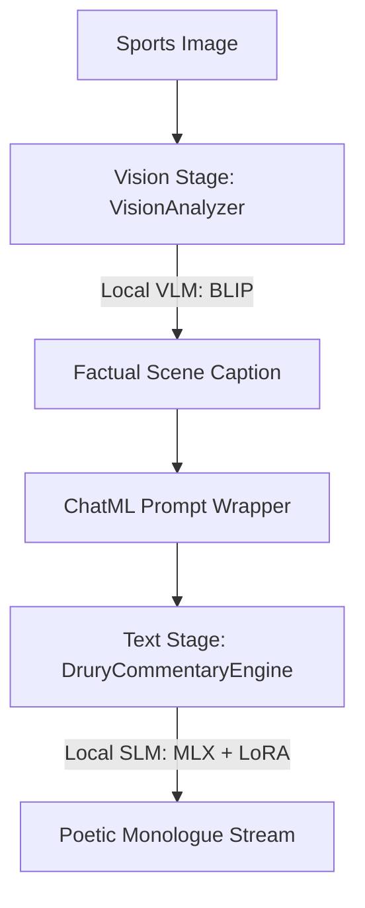

# Peter Drury Vision-to-Commentary Pipeline

A modular, production-ready Python pipeline that translates sports scenes (images) into poetic, Shakespearean-infused monologues in the style of legendary football commentator Peter Drury.

> [!WARNING]
> **System Compatibility**: This project is designed exclusively for **Apple Silicon (M-series) macOS devices using the MLX framework**. It leverages Apple's unified memory architecture for accelerated local inference and is not compatible with Windows, Linux, or Intel-based Macs.
>
> 🎙️ **Shout-out to the Legend**: Massive appreciation and shout-out to the legendary [Peter Drury](https://en.wikipedia.org/wiki/Peter_Drury), the poet laureate of football commentary, whose unmatched dramatic cadence and Shakespearean delivery inspired this project!

---

## 1. Technical Architecture & Reasoning

The system is decoupled into two key machine learning phases coordinated by a central orchestrator:



### A. Vision Stage: Local Scene Understanding
*   **Model Selected**: `Salesforce/blip-image-captioning-large`
*   **Reasoning**: BLIP (Bootstrapping Language-Image Pre-training) is highly efficient and optimized for producing accurate, descriptive structural summaries of general visual scenes. Running locally, it extracts the objective facts (e.g., player actions, locations on the pitch, ball positions) without injecting subjective opinions.
*   **Hardware Acceleration**: Uses PyTorch's Metal Performance Shaders (`mps`) backend on Apple Silicon to perform lightning-fast GPU-accelerated visual preprocessing and beam search.

### B. Text Stage: Local Poetic Style Transfer
*   **Model Selected**: `mlx-community/Phi-3-mini-4k-instruct-4bit` (Base SLM)
*   **Reasoning**: Apple's MLX framework uses **Unified Memory** on macOS, allowing the GPU and CPU to share the same physical RAM. This removes the VRAM bottlenecks common in CUDA systems, enabling ultra-fast local inference. Using a 4-bit quantized model (Phi-3-mini) ensures the system fits into standard memory envelopes while maintaining robust instruction-following capabilities.
*   **Stylistic Adaptation (QLoRA)**: Instead of costly full parameter fine-tuning, we use **Quantized Low-Rank Adaptation (QLoRA)**. It freezes the base 4-bit model and trains lightweight parameter adapters (`./drury_adapters`) containing low-rank updates. This teaches the model the highly specific Shakespearean cadence, dramatic pauses, and sports terminology of Peter Drury without forgetting base English grammar.

### C. Formatting & Prompt Wrappers
*   **ChatML Template**: Standardizes dialogue boundaries. By training on and prompting with this exact format, the model knows exactly when system context ends, when user scene input starts, and when to begin generating the assistant's monologue:
    ```text
    <|im_start|>system
    You are Peter Drury, the poetic football commentator. Turn the factual scene into a dramatic monologue.<|im_end|>
    <|im_start|>user
    Scene: [FACTUAL_DESCRIPTION_FROM_VLM]<|im_end|>
    <|im_start|>assistant
    ```

---

## 2. Model Mechanics: BLIP to QLoRA SLM

This section details how image features are processed by the VLM and transformed into a token sequence ingested by the SLM.

### A. How BLIP Generates Scene Descriptions
BLIP (Bootstrapping Language-Image Pre-training) is a multimodal encoder-decoder model:
1. **Vision Encoding (ViT)**: The input image is resized and sliced into non-overlapping patches (e.g., $16 \times 16$). These patches are projected into a sequence of vector embeddings.
2. **Self-Attention**: The Vision Transformer (ViT) processes these patch embeddings using self-attention layers to model spatial relationships (e.g., associating the ball vector with the pitch markings and goal net vectors).
3. **Cross-Attention Decoding**: The text decoder receives the final visual feature sequence. During text generation, the decoder's cross-attention layers align visual features with text tokens:
   - **Queries ($Q$)** are derived from the generated text prefix.
   - **Keys ($K$) and Values ($V$)** are mapped directly from the visual output of the ViT.
4. **Autoregressive Generation**: The model uses beam search (maintaining multiple candidate paths) to predict the most probable sequence of words detailing the scene, returning a factual string (e.g., *"a soccer player kicking the ball into the net"*).

### B. How the SLM Ingests VLM Output via QLoRA
1. **ChatML Formatting**: The factual description string is inserted into the ChatML template. The system prompt configures the "persona" (Peter Drury + Shakespearean style).
2. **Tokenization**: The SLM tokenizer converts the complete ChatML character sequence into token IDs. These IDs are then projected into dense word embeddings.
3. **Low-Rank Projection (QLoRA)**:
   - The base 4-bit weights of the SLM ($W_0$) are frozen.
   - For layers configured with adapters (specifically key, query, and value projection matrices in self-attention), MLX adds low-rank update matrices $A$ and $B$:
     $$h = W_0 x + \Delta W x = W_0 x + \frac{s}{r} (B \cdot A) x$$
     where $r$ is the rank (typically $8$ or $16$) and $s$ is the scale.
   - The trained adapter matrices ($B \cdot A$) act as a stylistic steering wheel. Because they were trained on Shakespearean-Drury text, they adjust the attention weights of the prompt, making the model place higher activation values on dramatic, metaphoric vocabulary (e.g., *"Titan"*, *"tempest"*, *"miracle"*) when generating response tokens.
4. **Streaming Inference**: At each generation step, the model computes logits over the vocabulary, applies top-p ($0.9$) and temperature ($0.85$) sampling to ensure creative expression, and yields the decoded token before feeding it back as context for the next token.

---

## 3. Project Structure

```text
Druryism/
├── data/
│   ├── train.jsonl       # 24 Shakespearean-infused Drury training samples
│   └── valid.jsonl       # 6 validation samples
├── docs/                 # Web documentation & evaluation reports
│   ├── index.html        # Interactive GitHub Pages showcase
│   ├── eval_report.html  # Visual side-by-side evaluation dashboard
│   └── eval_results.json # Raw evaluation metrics data
├── drury_adapters/       # Created post-training (holds adapters.safetensors)
├── pipeline.py           # Main inference pipeline (VisionAnalyzer, Engine, Orchestrator)
├── eval.py               # Evaluation suite script (fine-tuned vs baseline)
├── generate_dataset.py   # Dataset creator script (pre-run)
├── train.sh              # Fine-tuning automation script (installs deps + trains)
├── run_all.sh            # E2E pipeline runner (orchestrates data check, training, eval, and inference)
└── README.md             # Project documentation (this file)
```

---

## 4. Installation & Setup

1.  **Clone / Navigate** to your project folder:
    ```bash
    cd "/Users/dhnam/Desktop/Data Projects/Druryism"
    ```

2.  **Install base packages**:
    It is recommended to run this inside a virtual environment or directly on your system Python:
    ```bash
    pip install torch transformers Pillow mlx mlx-lm
    ```
    *(If you use the `uv` package manager, run: `uv pip install torch transformers Pillow mlx mlx-lm`)*

---

## 5. Execution Steps

### Quick Start: Run Everything Automatically
If you want to run the entire pipeline in one go (checking/generating datasets, training adapters if they are missing, running evaluations, and executing the main inference pipeline), run the orchestrator script:
```bash
chmod +x run_all.sh
./run_all.sh
```
Otherwise, you can follow the manual step-by-step instructions below.

### Step 1: Pre-generate or Verify Dataset
The dataset has already been populated at `data/train.jsonl` and `data/valid.jsonl` with 30 high-quality Shakespearean-Drury entries. If you ever need to reset or rebuild the dataset, run:
```bash
python3 generate_dataset.py
```

### Step 2: Fine-Tune the Drury Adapters
To run the QLoRA trainer locally on Apple Silicon, execute the training runner:
```bash
./train.sh
```
This script will:
*   Install or update the `mlx-lm` training extensions (`mlx-lm[train]`).
*   Train the base Phi-3-mini model against the dataset in the `./data` folder for 200 iterations.
*   Save the fine-tuned adapters inside the `./drury_adapters` directory.

### Step 3: Run the Vision-to-Commentary Pipeline
Once the adapters are trained, execute the main end-to-end script:
```bash
python3 pipeline.py
```
**What happens under the hood:**
1.  **Mock Image Creation**: The pipeline checks if a sports image is present. If missing, it generates a mock soccer pitch image (`mock_match_pitch.jpg`) to ensure it runs out-of-the-box.
2.  **Factual Extraction**: The `VisionAnalyzer` loads the BLIP model on the GPU (`mps`) and generates a factual description of the image.
3.  **Monologue Stream**: The `DruryCommentaryEngine` loads the MLX base model and applies your newly trained `./drury_adapters`. It formats the prompt in ChatML, then streams the dramatic monologue token-by-token directly to your terminal.

### Step 4: Run the Model Evaluation Suite
To quantitatively and qualitatively compare the performance of the fine-tuned model against the baseline SLM, run the evaluation script:
```bash
python3 eval.py
```
**What happens under the hood:**
1.  **Baseline Inference**: Loads the base MLX SLM (without adapters) and runs generation over a 10-scene evaluation dataset (comprising the 6 validation scenes and 4 out-of-domain generalization scenes).
2.  **Fine-Tuned Inference**: Loads the MLX SLM with the trained `./drury_adapters` and generates commentary for the same 10 scenes.
3.  **Metrics Computation**: Calculates text length, inference speed (tokens/sec), Druryism poetic keyword density, dramatic punctuation counts, and vocabulary richness (Type-Token Ratio).
4.  **Report Generation**: Saves raw metrics to `docs/eval_results.json` and builds the self-contained visual dashboard at `docs/eval_report.html`.

### Step 5: Open the Showcase & Evaluation Report
To view the interactive showcase page and the detailed evaluation results locally, open the HTML documents in your browser:
*   **Showcase / Documentation Page**: Open [docs/index.html](file:///Users/dhnam/Desktop/Data%20Projects/Druryism/docs/index.html) in your browser. It displays the step-by-step pipeline visualizer, a simulated commentary playground, and a QLoRA attention weight steering simulator.
*   **Evaluation Dashboard**: Open [docs/eval_report.html](file:///Users/dhnam/Desktop/Data%20Projects/Druryism/docs/eval_report.html) in your browser to inspect the comparative metrics, interactive charts, and side-by-side dialogue highlights.

---

## 6. Fail-Safe Operations

*   **Adapter Fallback**: If the pipeline is run before training the adapters (or if the `./drury_adapters` directory is deleted), the `DruryCommentaryEngine` will log a warning and automatically fall back to the base model. This allows you to verify code execution at any time.
*   **Version-Agnostic Sampling**: Different versions of the `mlx-lm` library use different argument structures for generation parameters (e.g., requiring a `make_sampler` object vs direct `temp`/`temperature` arguments). The engine automatically resolves this using a multi-attempt handler to prevent runtime `TypeError` crashes.
